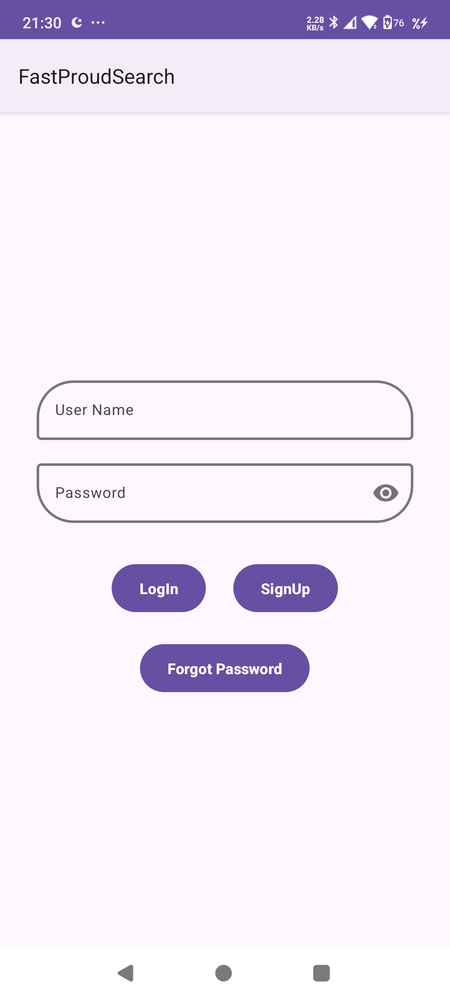
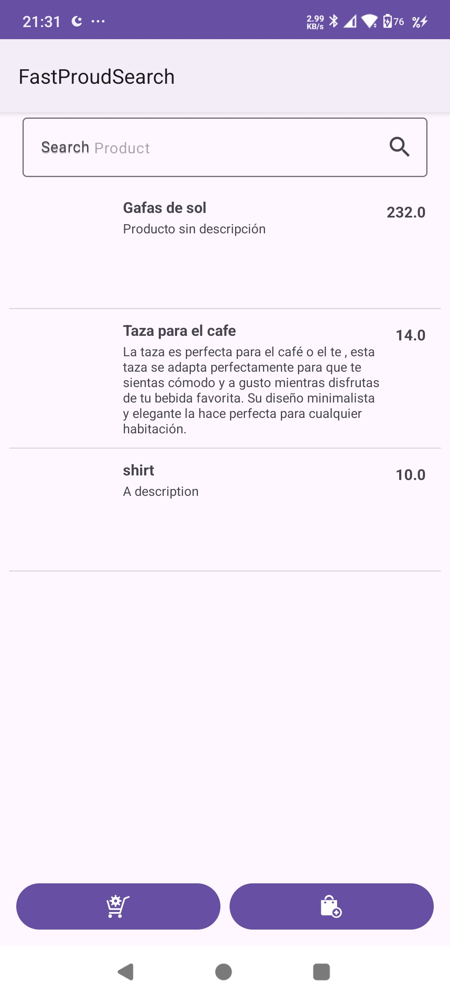
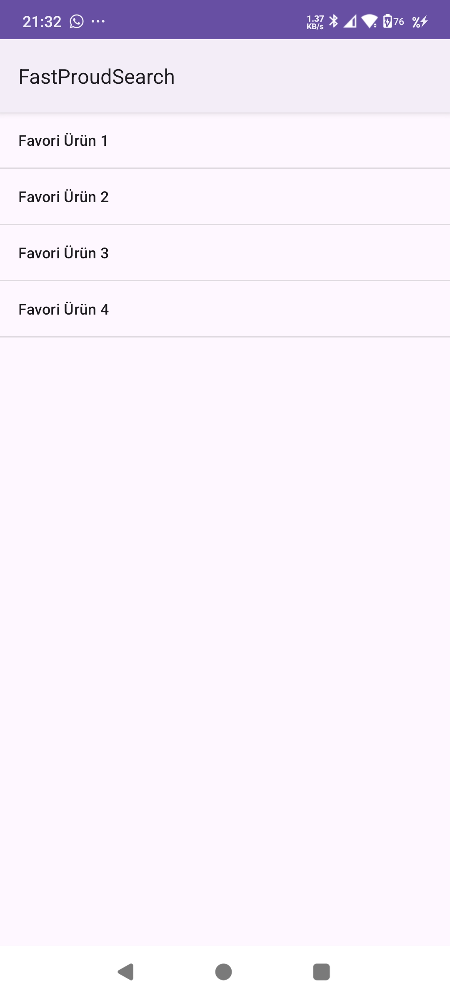
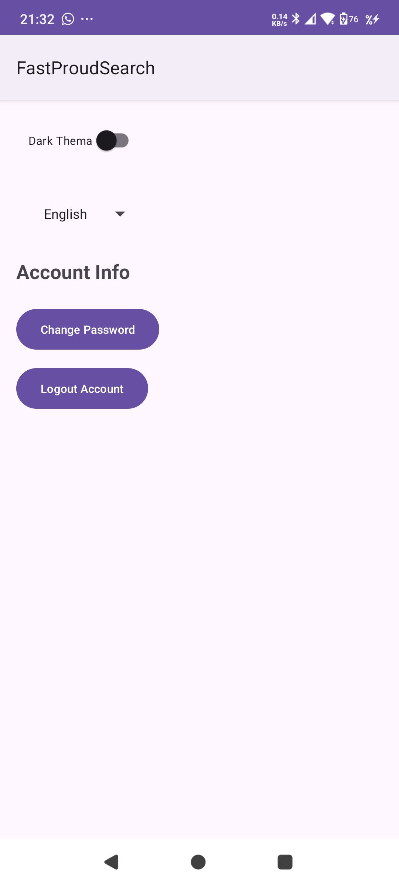

# Mobile App

Bu proje, Java ile geliştirilmiş bir mobil uygulamadır. Kullanıcılar hesap doğrulaması, ürün arama ve favorilere ekleme gibi işlemleri gerçekleştirebilir.

## Uygulama Görüntüleri
   

## Özellikler

- **Firebase Authentication**: Hesap doğrulaması ve şifre sıfırlama.
- **API Kullanımı**: Market sayfasındaki ürünlere erişim.
- **Favoriler**: Kullanıcıların favorilere eklediği ürünleri Firebase Realtime Database'de saklama.
- **Tema ve Dil Ayarları**: Uygulama temasını ve dilini özelleştirme.

## Gereksinimler

- Minimum SDK: 31 (Android 12)
- Hedef SDK: 35 (Android 14)
- Geliştirme Ortamı: Android Studio

## Kurulum

1. Depoyu klonlayın:
    ```bash
    git clone https://github.com/MertRamazanEMEK/mobile-app.git
    ```
    veya doğrudan GitHub sayfasından zip dosyasını indirip çıkarın.
2. Android Studio kullanarak projeyi açın.

## Kullanım

1. **Sanal Cihazda Çalıştırma**: Android Studio'daki bir emülatör üzerinden uygulamayı başlatabilirsiniz.
2. **Gerçek Cihazda Çalıştırma**:
    - Geliştirici seçeneklerini etkinleştirin.
    - Telefonunuzu bilgisayara bağlayarak uygulamayı cihaz üzerinde çalıştırın.

### Uygulamada Bulunan Sayfalar

- Hesap Yönetimi: Giriş yapma, hesap oluşturma, şifre sıfırlama.
- Ürün Arama: API üzerinden ürün arama ve listeleme.
- Favori Ürünler: Ürünleri favorilere ekleme ve yönetme.
- Tema ve Dil Ayarları: Uygulama temasını ve dilini değiştirme.
